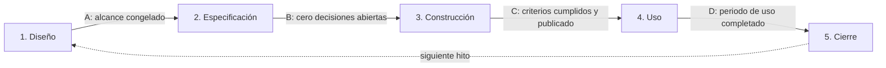
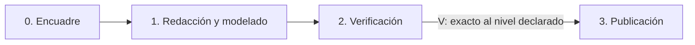

# Método de desarrollo de Neuroteca

Este documento define **cómo se construye el atlas**. No describe qué es el atlas (eso es
`motor/arquitectura.md`) ni cómo se estructuran sus datos (eso es
`motor/esquema-contenido.md`). Esto es únicamente el proceso de trabajo entre Max y el
agente.

> **Si es tu primera vez aquí, este no es el primer archivo que debes leer.** Empieza por
> `EMPIEZA-AQUI.md` y sigue su orden de lectura obligatorio.

## Regla número uno

> **Lo que no está escrito no está decidido.**
>
> Este proyecto está diseñado para que lo opere cualquier agente sin memoria de sesiones
> anteriores. Ningún agente debe asumir, completar huecos con lo que "tendría sentido", ni
> decir "como habíamos quedado". Si falta información, se registra como decisión abierta y
> se pregunta. Nunca se rellena en silencio.
>
> Ante contradicción entre documentos se aplica la precedencia de
> `protocolo-de-sesion.md` §4 — y la contradicción **se reporta**, no se resuelve sola.

## El problema que este método resuelve

En un desarrollo exploratorio el agente pregunta a mitad del trabajo. No lo hace por falta
de disciplina: lo hace porque **la especificación tenía huecos**, y el hueco solo se hace
visible cuando ya se está construyendo. El resultado es un desarrollo lento, lleno de
decisiones sueltas, que nunca llega a un punto donde se pueda usar de verdad.

En un proyecto largo se suma un segundo problema: **el contexto se pierde**. Entre sesión
y sesión cambia el agente; entre etapa y etapa pueden pasar meses. Lo que no quedó escrito
hay que volver a decidirlo, y a menudo se decide distinto.

Este método ataca ambos con cuatro mecanismos:

1. **Cerrar las decisiones antes de construir**, con una compuerta que exige que la lista
   de decisiones abiertas llegue a cero.
2. **Pre-autorizar al agente a decidir** durante la construcción, con reglas declaradas una
   sola vez, para que no tenga que interrumpir.
3. **Congelar el alcance** de cada hito, para que lo nuevo se acumule en un backlog en
   lugar de estirar el trabajo en curso.
4. **Poner techo a los archivos de arranque**, para que retomar el proyecto después de una
   pausa cueste lo mismo el primer año que el quinto.

---

# Parte I — Los dos carriles

El atlas no es solo software ni solo contenido. Son dos tipos de trabajo con ritmos y
riesgos distintos, y meterlos en el mismo ciclo los daña a los dos: el software necesita
que las decisiones se cierren antes de construir, y el contenido necesita poder crecer
ficha a ficha sin abrir un expediente cada vez.

| | **Carril Software** | **Carril Contenido** |
|---|---|---|
| **Produce** | El motor y las piezas de la aplicación | Fichas neuro y activos visuales |
| **Unidad** | Hito `vX.Y-<nombre>` | Lote `L-NNN-<nombre>` |
| **Ciclo** | 5 fases | 4 pasos |
| **Compuertas** | A, B, C, D | V (verificación) |
| **Riesgo que controla** | Construir lo que no se quería | Publicar algo inexacto |

**Los dos carriles pueden avanzar a la vez**, pero **una sola sesión trabaja en un solo
carril**. Mezclarlos en una sesión es la forma más rápida de que ninguno cierre bien.

## Motor y piezas

El atlas se organiza en un **motor** (uno solo: el armazón, la navegación, la carga de
datos, el tema visual) más **piezas** autocontenidas que se enchufan a él.

**Una pieza es una capacidad de la aplicación**, no un dominio neuroanatómico. Ejemplos de
pieza: el visor anatómico, el buscador, el simulador fisiológico, el glosario. La corteza
o las vías motoras **no son piezas**: son contenido que atraviesa las piezas.

> **Por qué así:** el valor del aislamiento es que una pieza pueda fallar o apagarse sin
> tumbar el atlas. Eso solo es cierto si las piezas son capacidades independientes. Si
> fueran dominios neuro, todas compartirían la misma interfaz y el aislamiento sería
> ficticio.

### Criterios de aislamiento obligatorios de toda pieza

Van en la fase 1 de todo hito de pieza y **no se borran ni se reformulan**:

| ID | Criterio |
|---|---|
| `CA-A1` | Apago esta pieza desde el motor y el atlas sigue funcionando igual; ninguna otra pieza se ve afectada. |
| `CA-A2` | Esta pieza falla y el resto del atlas sigue usable; el visitante ve la pieza degradada, no una pantalla en blanco. |

`CA-A2` importa más aquí que en una aplicación privada: el atlas es público y se abre en
navegadores y dispositivos que no controlamos. Una pieza que se rompe en un móvil viejo no
puede llevarse el atlas entero por delante.

## El esquema de contenido es el contrato

`motor/esquema-contenido.md` define qué campos tiene una ficha, qué formatos acepta un
activo visual y cómo se declara el nivel de detalle. Cumple el mismo papel que un contrato
de módulos: **es lo que permite que el contenido crezca durante años mientras la
aplicación se reescribe entera.**

- Se versiona **aparte** del motor y de las piezas.
- Ninguna pieza se diseña antes de que exista `esquema v1`.
- Un cambio **rompiente** del esquema (que invalide contenido ya publicado) es excepción
  tipo 1: se detiene y lo decide Max.

### Regla de secuencia

El contenido no depende de que exista la aplicación: **se puede redactar y modelar antes**,
siempre que cumpla el esquema vigente. Lo que no se puede es publicarlo sin una pieza que
lo sepa mostrar.

---

# Parte II — Carril Software

## Concepto central: versión e hito

Cada pieza (y el motor) se organiza en **versiones**: el contrato de **visión y
capacidades** de esa pieza, a alto nivel, numerado (`v0`, `v1`, `v2`…). Una vez que arranca
su primer hito, la visión de una versión **se mantiene fija** y puede recibir cualquier
número de hitos a lo largo del tiempo, mientras esos hitos no la cambien.

El **hito** es la unidad real de trabajo: un checkpoint **dentro de la visión fija de su
versión**. Se puede **usar completo**, aunque haga poco. Nunca es "la base" ni "media
funcionalidad". Es una rebanada vertical: entra por un lado, sale por el otro, y sirve.

Se nombra `vX.Y-<nombre>`: **`X` es la versión**, **`Y` es el hito** dentro de ella.

> **Cómo se decide si el siguiente hito es `Y+1` o `X+1`:** la pregunta es **si el trabajo
> cambia la visión de alto nivel de la pieza**, no si se planeó desde antes.
>
> - **`Y+1`** — cabe dentro de la visión ya declarada, aunque sea una idea que surgió
>   después, usando el atlas.
> - **`X+1`** — agrega o quita una capacidad de la visión, o exige una refactorización
>   mayor por un cambio en otra parte del sistema (típicamente el motor o el esquema).

El propósito de cada versión se registra como **boceto revisable** en la tabla "Versiones"
de `motor/arquitectura.md` (motor) o `ficha.md` (pieza).

Cada hito atraviesa 5 fases y 4 compuertas. No se avanza sin pasar la compuerta.

### Tamaño y presupuesto del hito

El presupuesto **no existe para estimar cuánto vas a tardar**. Existe para una sola cosa:
detectar que el alcance se desbordó y disparar la partición. Por eso se mide en pasos del
plan, no en tiempo.

| Momento | Qué se declara | Para qué |
|---|---|---|
| **Fase 1** | Expectativa gruesa: `Chico` · `Mediano` · `Grande` | Alinear expectativas. No dispara nada. |
| **Fase 2** | **Presupuesto real: número de pasos del plan** | Es contra este número que se mide la partición. |

> **Regla de partición:** si los pasos ejecutados rebasan **1.5× los pasos presupuestados
> en la fase 2**, el agente se detiene, entrega lo que ya funciona como versión reducida, y
> el resto pasa a un hito nuevo. No se pide extensión: se parte.

**Regla de granularidad:** un paso produce algo verificable por sí solo y cabe en una tanda
de trabajo. Si un paso no se puede describir en una línea concreta, hay que partirlo. Un
plan con menos de 3 pasos casi siempre está mal desglosado.

**Por qué así:** cualquier agente sin contexto puede verificarlo solo, contando las filas
de la tabla del plan contra los pasos ejecutados en la bitácora de construcción. Las
sesiones **no disparan la partición**: una sesión cortada por falta de contexto no
significa que el alcance haya crecido.

### Procedimiento de partición

Partir un hito deja criterios de aceptación sin cumplir, y la compuerta C exige que se
cumplan todos. Los tres pasos son obligatorios y en este orden:

1. **Se identifican los `CA` no producidos** y se registran en `backlog.md` como hito nuevo
   propuesto, con destino y prioridad.
2. **Se emite `01-diseno.md` v2** marcando esos `CA` como `Diferido a vX.Y`, con su fila en
   el historial de versiones. Es una **reapertura acotada de la compuerta A** y la aprueba
   Max: es la única forma autorizada de reducir un alcance congelado.
3. **La compuerta C se evalúa solo contra los `CA` vigentes** (los no diferidos).

## Reapertura de una compuerta

"Alcance congelado" no significa que Max no pueda corregirse. Significa que corregirse
**deja rastro** en vez de suceder en silencio.

| Quién puede pedirla | Cuándo |
|---|---|
| **Max** | Cuando quiera, sobre cualquier compuerta ya aprobada |
| **El agente** | Solo por excepción tipo 3, o al aplicar la partición |

Procedimiento, siempre igual:

1. Subir la versión del documento de fase afectado y anotar la fila en su historial, con el
   motivo. **Nunca se edita en silencio un documento ya aprobado.**
2. Poner su casilla "Max aprobó" en `Pendiente`.
3. Retroceder la fase en `estado.md` y registrar la reapertura en la bitácora.
4. Si se reabre la **compuerta A**, revisar el plan de la fase 2 completo: cambiar el
   diseño casi siempre invalida pasos. Si ocurre, también se reabre la B.

> Reabrir es caro a propósito. Pero es infinitamente más barato que construir algo que Max
> ya sabe que no quiere.

## Cómo se responden las preguntas de las fases 1 y 2

Dos entradas al mismo documento. El `.md` de la fase es siempre la fuente de verdad; lo que
se hable por chat, el agente lo escribe ahí igual.

| Modo | Cuándo | Cómo funciona |
|---|---|---|
| **Chat** | Cuando hace falta conversación para que la idea tome forma | Se habla; el agente escribe al documento de fase |
| **Cuestionario** | Cuando Max prefiere formato de documento y responder a su ritmo | El agente genera `00-cuestionario.md`; Max lo contesta; el agente lo integra |

**Default por fase:** fase 1 → chat (el diseño es conversacional). Fase 2 → cuestionario
(es casi toda preguntas cerradas).

### Regla de propiedad de archivos

- **Max escribe únicamente en `00-cuestionario.md` y en `preguntas.md`.**
- **El agente escribe únicamente en los documentos de fase.**

Si Max quiere cambiar algo de un documento de fase, lo dice por chat o lo anota en el
cuestionario; el agente lo aplica. Así nunca se pisan ediciones.

### Cómo debe verse un cuestionario

De **opción cerrada donde se pueda**: el agente propone las opciones con su recomendación
marcada, y Max contesta marcando, no redactando. Texto libre solo donde de verdad esté
abierto. **Un cuestionario que pide párrafos no se llena.**

---

## Fase 1 — Diseño

**Pregunta que responde:** ¿qué va a poder hacer esta versión, y qué explícitamente no?

Modo default: **chat**. El agente propone el documento completo; Max lo revisa, corrige y
aprueba. Toda la discusión del hito ocurre aquí y aquí se agota.

**Contenido obligatorio** (ver `plantillas/01-diseno.md`):

- Pieza (`motor` o nombre de pieza), número y nombre de versión. Versión de esquema de
  contenido que usa, si toca contenido.
- **Frase de valor:** "al terminar este hito voy a poder ___, que hoy no puedo".
- **Funciones incluidas** (`F-01`, `F-02`…): lista cerrada y numerada.
- **Visualización:** cómo se ve y cómo se usa. Pantallas, flujo, diagrama.
- **Fuera de alcance:** lista explícita de lo que esta versión NO hace. Tan importante como
  la lista de funciones — es lo que protege el hito de crecer.
- **Criterios de aceptación** (`CA-01`…): en lenguaje de uso, verificables con sí o no.
  Si es pieza, incluye `CA-A1` y `CA-A2` obligatorios.
- **Expectativa de tamaño** y periodo de uso de la fase 4.

### Compuerta A → fase 2
- [ ] Cada función tiene al menos un criterio de aceptación.
- [ ] La lista de "fuera de alcance" no está vacía.
- [ ] Los criterios se pueden responder con sí o no, sin opinar.
- [ ] Si es pieza: `CA-A1` y `CA-A2` presentes, y la versión de esquema declarada.
- [ ] Si toca el esquema de contenido: declarado si el cambio es compatible o rompiente.
- [ ] Max aprobó el documento.

**Al pasar esta compuerta el alcance queda congelado.** Cualquier idea posterior va a
`backlog.md`, no a este hito.

---

## Fase 2 — Especificación

**Pregunta que responde:** ¿cómo se construye, y qué decisiones faltan por tomar?

Modo default: **cuestionario**. Aquí el agente traduce el diseño a algo ejecutable **y,
sobre todo, caza los huecos**. Esta es la fase que compra el silencio de la fase 3.

> **Regla de promoción obligatoria:** toda nota de `01-diseno.md` que diga "se cierra en
> fase 2" **se convierte, sin excepción, en una fila de la tabla de decisiones abiertas**.
> Nunca puede quedar solo como comentario de texto: una nota suelta no bloquea nada, una
> fila en esa tabla sí.

**Contenido obligatorio** (ver `plantillas/02-especificacion.md`):

- **Requerimientos técnicos** (`RT-01`…): stack, formatos, límites, rendimiento.
- **Estructura de datos:** qué se guarda, en qué formato, dónde vive, cómo se lee.
- **Conformidad con el esquema de contenido**, si lo toca.
- **Dependencias** (`DEP-01`…).
- **Decisiones cerradas** (`DEC-01`…): opciones consideradas, elegida y por qué.
- **Decisiones abiertas:** la lista que debe llegar a cero.
- **Plan de construcción:** pasos ordenados, cumpliendo la regla de granularidad.
- **Presupuesto:** número total de pasos, y su límite de partición (1.5×).
- **Presupuesto de peso:** cuánto suma este hito al sitio publicado (ver Parte IV).

### El barrido de huecos

Antes de declarar cerrada la especificación, el agente recorre esta lista y **responde cada
punto por escrito**. Cada respuesta que no exista se convierte en una decisión abierta que
hay que cerrar.

1. **Estado vacío:** ¿qué se ve la primera vez, sin ningún dato?
2. **Errores:** ¿qué pasa si algo falla, y qué ve el visitante cuando pasa?
3. **Límites:** ¿cuántos elementos, qué tamaño máximo, y qué pasa al rebasarlo?
4. **Textos visibles:** ¿está escrito el texto exacto de cada botón, título y mensaje?
5. **Identidad visual:** ¿la apariencia (paleta, tipografía, densidad, layout) está
   confirmada con Max, o el hito construye con un placeholder que Max aceptó
   explícitamente como tal? Si no hay respuesta clara, es decisión abierta — no se asume ni
   se construye con un estilo inventado por el agente.
6. **Persistencia:** el atlas es un sitio estático. ¿Qué guarda el navegador (preferencias,
   última vista, progreso)? ¿Qué pasa si se borra? ¿Qué pasa en modo privado?
7. **Segunda vez:** ¿qué se ve al reabrir? ¿recuerda algo de la visita anterior?
8. **Contenido previo:** ¿hay que migrar fichas o activos ya publicados? ¿qué pasa con los
   que ya existían?
9. **Entradas inválidas:** ¿qué pasa si se escribe cualquier cosa donde no va, o se llega
   por una URL que ya no existe?
10. **Pantalla y dispositivo:** ¿funciona en teléfono? El atlas es público: **móvil no es
    opcional**. Decir explícitamente qué se degrada en pantalla pequeña.
11. **Deshacer:** ¿algo se puede perder desde la interfaz? ¿se puede recuperar?
12. **Rendimiento tolerable:** ¿cuánto puede tardar antes de sentirse mal, **y en qué
    conexión y qué equipo**? Se mide, no se supone.
13. **Fin del flujo:** ¿qué pasa cuando el visitante termina? ¿a dónde va?
14. **Accesibilidad:** ¿se puede usar solo con teclado? ¿tiene equivalente textual lo que
    es visual? ¿el contraste cumple? **Un activo 3D o un diagrama siempre necesita una
    alternativa que no dependa de verlo ni de manipularlo.**
15. **Sin conocimiento previo:** ¿alguien que llega sin saber de neurociencia ni de
    programación entiende qué está viendo y qué puede hacer? Si la respuesta depende de
    leer instrucciones, es decisión abierta.
16. **Peso:** ¿cuánto pesa lo que este hito añade al sitio publicado, y cabe en el
    presupuesto? Se mide sobre el export real, no sobre el archivo fuente.
17. **Reglas ya sabidas:** ¿qué reglas de `reglas-del-agente.md` tocan lo que hace este
    hito, y cómo las cumple el plan? Se listan por su texto, leído en el archivo, no de
    memoria. Si ninguna aplica, se dice explícitamente.

**Punto 18, solo si es pieza:**

18. **Apagado y convivencia:** ¿qué pasa cuando se apaga esta pieza? ¿comparte algo con
    otra? Si sí, ¿por qué no es una violación del aislamiento?

### Compuerta B → fase 3
- [ ] El barrido de huecos está respondido punto por punto.
- [ ] **La lista de decisiones abiertas está vacía.**
- [ ] La identidad visual (punto 5) quedó confirmada o explícitamente aceptada como
      placeholder por Max — nunca inventada por el agente en silencio.
- [ ] Cada `CA-NN` de la fase 1 aparece en la columna "Produce" del plan.
- [ ] El plan cumple la regla de granularidad y el presupuesto en pasos está declarado.
- [ ] El presupuesto de peso está declarado.
- [ ] **Snapshot tomado** (`git commit` con el estado previo a construir).
- [ ] Max aprobó el documento.

Esta es la compuerta dura del método. Si no se cumple, la fase 3 va a interrumpir.

---

## Fase 3 — Construcción

**Pregunta que responde:** ninguna. Aquí solo se ejecuta el plan.

El agente construye de corrido, sin consultar. Registra en `03-bitacora-construccion.md`
cada decisión que haya tenido que tomar (`DC-NN`).

### Las 3 excepciones que sí detienen

1. **Es irreversible o destructiva** sobre contenido o datos que ya existen — incluye
   **todo cambio rompiente del esquema de contenido**.
2. **Toca seguridad, privacidad o exactitud publicable**: datos de terceros, o cualquier
   afirmación neurocientífica que se publicaría sin haber pasado por la compuerta V.
3. **Cambia el alcance** acordado en la fase 1: agrega o quita una función, vuelve
   imposible un criterio de aceptación, **invalida el plan de la fase 2** (reordenar,
   fusionar o sustituir pasos), o **requiere del motor algo que el esquema no da**.

Todo lo demás: el agente decide con `reglas-del-agente.md`, lo registra como `DC-NN`, y lo
reporta al cerrar la fase.

### Prohibiciones durante la construcción

- **No se agregan funciones** que no estén en la fase 1, aunque sean triviales. Van al
  backlog.
- **No se rediseña.** Si el plan resultó malo, eso es excepción tipo 3: se detiene.
- **No se deja nada a medias.** Si no cabe, se aplica la partición.
- **No se toca el motor desde un hito de pieza.** Si una pieza necesita algo que el motor
  no da, es excepción tipo 3: se propone un hito de motor.
- **No se redacta contenido neurocientífico.** Eso es el carril de contenido y tiene su
  propia compuerta. Un hito de software usa contenido de prueba claramente marcado como tal.

### Compuerta C → fase 4
- [ ] Todos los criterios de aceptación **vigentes** se cumplen, verificados uno por uno.
- [ ] La bitácora de construcción está completa.
- [ ] **Publicado y verificado en el sitio real**, no solo en local: se abre la URL de
      GitHub Pages y se comprueba ahí al menos un `CA`, y la carga en móvil.
- [ ] El peso real del sitio publicado está medido y dentro del presupuesto.
- [ ] Si es pieza: `CA-A1` y `CA-A2` probados de verdad (apagándola y rompiéndola), y
      `piezas.md` actualizado.
- [ ] Si cambió el esquema de contenido: `esquema-contenido.md` y `arquitectura.md`
      actualizados, con su nueva versión.
- [ ] **Snapshot tomado** (`git commit` con lo construido) y **etiqueta** `vX.Y` creada.
- [ ] **Max aprobó el cierre de la construcción.**

> La compuerta C es la salida de la única fase donde el agente trabajó solo. Es la que
> **menos** puede autocertificarse. El agente presenta la evidencia de cada `CA`; la
> aprobación es de Max.
>
> **"Funciona en mi máquina" no cruza esta compuerta.** El atlas existe para que lo use
> gente en la web; hasta que no está en la web, el hito no terminó.

---

## Fase 4 — Uso

**Pregunta que responde:** ¿esto sirve de verdad?

Max usa la versión publicada durante el periodo declarado en la fase 1. El agente no toca
nada durante ese periodo salvo defectos.

| | Definición | Qué se hace |
|---|---|---|
| **Defecto** | Algo que la fase 1 prometió y no funciona, o funciona mal. | Se corrige en esta versión. |
| **Mejora** | Algo que la fase 1 nunca prometió. | Va a `backlog.md`. No se toca. |

Si algo se siente incómodo pero cumple su criterio de aceptación, es una mejora, no un
defecto. Esa incomodidad es información valiosa: se anota y alimenta el siguiente hito.

### Compuerta D → fase 5
- [ ] El periodo de uso se completó, **o Max lo dio por concluido antes**.
- [ ] Los defectos están corregidos o registrados como asumidos.
- [ ] `04-aceptacion.md` tiene cada criterio marcado con evidencia.
- [ ] Las mejoras están copiadas al backlog.

---

## Fase 5 — Cierre

**Pregunta que responde:** ¿qué aprendimos y qué sigue?

Dos partes, y solo una es obligatoria. Si fuera toda obligatoria nadie la haría, y un
método que no se cierra no aprende.

### Cierre mínimo — siempre

1. **¿Se cumplió la frase de valor?** Sí / Parcialmente / No, y por qué.
2. **Mejoras al backlog.** Todo lo que incomodó usándolo.
3. **Propuesta del siguiente hito (si hay candidata)** — decir si sería `Y+1` o `X+1`, y
   por qué. No hace falta que haya propuesta.

### Meta-revisión del método — solo si se disparó

Se hace **únicamente** si ocurrió alguna de estas tres cosas, porque son las señales de que
falló el método, no el producto:

- Hubo excepciones registradas en la fase 3 (el agente tuvo que interrumpir).
- Se activó la regla de partición.
- Se reabrió alguna compuerta.

Contenido: qué le faltó a la fase 2 para haberlo previsto, qué cambia en este documento, y
qué `DC-NN` se promueven a `reglas-del-agente.md`.

> Si el hito corrió limpio de principio a fin, la meta-revisión no aporta nada y se salta.

---

# Parte III — Carril Contenido

**La unidad es el lote** (`L-NNN-<nombre>`): un conjunto de estructuras neuro que se
redactan, modelan y verifican juntas. Un lote puede ser una sola estructura o veinte; lo
que lo define es que comparten fuente, nivel de detalle y sesión de verificación.

## Niveles de detalle

El atlas se construye por **granularidad creciente**: primero la forma general, luego los
núcleos, luego las fibras. Para que eso sea verificable y no una excusa, cada estructura
declara el nivel al que está representada hoy.

| Nivel | Qué representa |
|---|---|
| **N1** | Forma general: volumen y silueta de una división mayor (lóbulo, tronco, cerebelo) |
| **N2** | Subdivisiones: giros y surcos principales, divisiones internas mayores |
| **N3** | Núcleos: núcleos y grupos celulares identificables |
| **N4** | Vías y fibras: tractos, conexiones, proyecciones |
| **N5** | Circuito: microanatomía y dinámica fisiológica |

Dos consecuencias, y las dos son el punto:

- **El atlas muestra el nivel.** El visitante siempre sabe si está viendo una forma
  esquemática o un detalle fino. Es honesto y evita que se use como lo que no es.
- **La verificación se hace contra el nivel declarado, no contra la perfección.** Un N1 es
  correcto si la forma, la posición y las relaciones con lo vecino son correctas, aunque no
  tenga un solo núcleo dentro. Sin esto, "no tiene que ser exacto al voxel" sería
  inverificable y la compuerta V no se podría cerrar nunca.

**Subir de nivel una estructura ya publicada es un lote nuevo**, no una corrección. Lleva
su propia compuerta V.

## Los 4 pasos

**Paso 0 — Encuadre** (`C0-encuadre.md`): qué estructuras entran, a qué nivel de detalle,
con qué fuentes previstas, quién redacta cada una (Max o el agente) y presupuesto de peso.
Es corto a propósito: media página basta.

**Paso 1 — Redacción y modelado:** se producen las fichas y los activos visuales, conforme
a `motor/esquema-contenido.md`. Cada ficha nace con estado `borrador`.

**Paso 2 — Verificación** (`C1-verificacion.md`): se revisa todo contra la compuerta V.

**Paso 3 — Publicación:** el contenido entra al sitio, las fichas pasan a `revisado`, y el
lote se registra en `estado.md` y en la bitácora.

## Compuerta V — Verificación de contenido

Se evalúa por lote, y la aprueba Max.

**Sobre el texto:**
- [ ] Cada afirmación tiene una fuente citada y localizable (obra, edición, página o DOI).
- [ ] La distinción entre lo establecido y lo discutido está explícita donde aplique.
- [ ] Ninguna afirmación proviene del modelo sin fuente. **Un agente no es una fuente.**

**Sobre los activos visuales:**
- [ ] El **nivel de detalle** está declarado y el activo es correcto a ese nivel:
      proporciones, posición y relaciones con las estructuras vecinas.
- [ ] **Origen y licencia** registrados: propio, derivado (de qué, con qué licencia), o de
      terceros (con qué permiso). Un activo sin origen registrado no se publica.
- [ ] El archivo fuente de modelado queda fuera del repositorio; al repo entra solo el
      export optimizado.
- [ ] **Peso medido** y dentro del presupuesto del lote.

**Sobre el conjunto:**
- [ ] Existe equivalente textual de lo que es visual (punto 14 del barrido).
- [ ] Autoría registrada por ficha (`Max` / `agente`) y estado (`borrador` / `revisado`).
- [ ] El contenido cumple el esquema vigente y valida sin errores.
- [ ] **Max aprobó el lote.**

> **Por qué la autoría se registra por ficha:** dentro de un año, saber de un vistazo qué
> texto pasó por tu criterio y cuál lo redactó un agente es la diferencia entre poder
> confiar en el atlas y tener que revisarlo entero otra vez.

## Qué hace un lote cuando falla la verificación

No se publica el lote a medias. Las fichas que pasan se publican; las que no, vuelven al
paso 1 **dentro del mismo lote** si el arreglo es acotado, o salen a un lote nuevo si
requieren más fuente o más modelado. Lo que nunca ocurre es que una ficha `borrador` llegue
al sitio publicado marcada como `revisado`.

---

# Parte IV — Convenciones

## Publicación y control de versiones

El atlas vive en un repositorio **público** y se publica en **GitHub Pages**. Git cumple
aquí dos funciones distintas:

| Función | Mecanismo |
|---|---|
| **Poder deshacer** | `git commit` en las compuertas B y C, y siempre que queden cambios |
| **Publicar** | La rama publicada, más una **etiqueta `vX.Y`** al cruzar cada compuerta C |

- **Ramas:** una por hito o por lote (`hito/vX.Y-nombre`, `lote/L-NNN-nombre`). La rama
  principal siempre refleja lo publicado.
- **Etiquetas:** `vX.Y` al cruzar la compuerta C. Es lo que permite volver a cualquier
  estado publicado del atlas.
- **`atlas-desarrollo/` se versiona pero no se publica** en el sitio: queda excluido de lo
  que Pages sirve.
- **`_referencia/` nunca entra a git.** Contiene material privado y el repositorio es
  público.

## Presupuesto de peso

GitHub Pages impone límites reales, y un atlas visual los toca antes que cualquier otro
tipo de sitio.

| Límite | Valor | Consecuencia |
|---|---|---|
| Archivo individual | **100 MB** | Rechazo duro al subir. Ningún activo se acerca. |
| Sitio publicado | **~1 GB** | Es el techo del proyecto entero. |
| Tráfico | ~100 GB/mes | Holgado salvo éxito masivo. |

**Presupuesto de trabajo: 400 MB de sitio publicado.** Es el número contra el que se mide,
no el límite duro — deja margen para crecer sin rediseñar nada.

Reglas que lo sostienen:

- **Al repositorio entra solo el export optimizado.** Los archivos fuente de modelado
  (`.blend` y equivalentes) viven fuera y están en `.gitignore`.
- **Malla, no volumen.** Geometría decimada y comprimida, nunca datos volumétricos crudos
  ni escaneos de alto polígono.
- **Git guarda cada versión de un binario entera.** Veinte iteraciones de un modelo pesan
  veinte veces: se itera fuera del repo y se comitea el resultado, no el camino.
- Cada hito y cada lote declaran cuánto suman, y se **mide sobre el export real**.

> **Si algún día el presupuesto se queda corto**, la salida es mover los activos a un CDN o
> a releases sin tocar el sitio. Por eso no hace falta decidirlo ahora: la decisión es
> reversible, y lo reversible se pospone.

## Techo duro de los archivos de arranque

**Este es el mecanismo que hace que el proyecto se pueda retomar dentro de tres meses o de
tres años al mismo coste.** Sin él, los archivos que todo agente debe leer crecen sin
límite hasta que arrancar en frío consume más contexto que trabajar.

| Archivo | Techo | Qué pasa al rebasarlo |
|---|---|---|
| `estado.md` | **150 líneas** | Lo más antiguo se mueve a `historial/estado-AAAA-MM.md` |
| `preguntas.md` | **100 líneas** | Las respondidas se retiran al cerrar; si no, a `historial/` |
| `bitacora/AAAA-TN.md` | un archivo por trimestre | Se abre archivo nuevo; el índice queda en `INDICE.md` |

Reglas:

- **`estado.md` describe el presente, no la historia.** Lo que ya no explica dónde estamos
  hoy no pertenece ahí, aunque haya costado escribirlo.
- **La bitácora nunca se lee entera.** El orden de lectura pide `INDICE.md` y la última
  entrada del trimestre en curso, no el archivo completo.
- **El cierre de sesión no está completo si algún techo quedó rebasado.** Es verificable:
  `wc -l` sobre los dos archivos.

## Licencias

El atlas es de acceso libre, así que la licencia no es un trámite final: condiciona qué se
puede usar desde el primer activo.

- **Código y contenido llevan licencias distintas**, declaradas en `LICENSE` y
  `LICENSE-CONTENIDO` en la raíz. *(Decisión pendiente — ver `preguntas.md`.)*
- **Todo activo visual registra su origen** en la compuerta V. Un activo sin origen
  registrado no se publica, aunque sea evidentemente propio.
- **Los modelos se hacen propios por decisión de proyecto**, no por falta de alternativas:
  evita el pantano de licencias de los atlas existentes y permite la granularidad creciente.

## Cómo arrancar un hito nuevo

1. **Paso 0 — conversación.** Si es el primer hito de una versión nueva, se conversa a
   fondo la visión de esa versión antes de escribir nada, y de ahí sale el boceto refinado
   y la frase de valor. Si es un hito más de una versión vigente, no se repite.
2. Crear `piezas/<pieza>/hitos/vX.Y-<nombre>/`.
3. Escribir `01-diseno.md` desde la plantilla.
4. Registrar el hito en `estado.md`.

## Cómo arrancar un lote nuevo

1. Crear `lotes/L-NNN-<nombre>/`.
2. Escribir `C0-encuadre.md` desde la plantilla — media página.
3. Registrar el lote en `estado.md`.

## Historial de versiones
| Versión | Fecha | Cambio principal |
|---|---|---|
| 1.1 | 2026-09-18 | El proyecto pasa a llamarse **Neuroteca**. |
| 1.0 | 2026-09-17 | Versión inicial. Adaptada del método de MIA v3.10: se conservan las 5 fases, las 4 compuertas, el barrido de huecos, la partición 1.5× y las reglas acumulables. Se añaden el carril de contenido con compuerta V, los niveles de detalle, el presupuesto de peso, la publicación como requisito de la compuerta C, y el techo duro de los archivos de arranque. |
