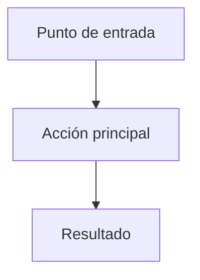

# Fase 1 — Diseño · vX.Y «<nombre>»

> El agente llena este documento completo y lo presenta para revisión. Toda la discusión
> del hito ocurre aquí. Al aprobarse, **el alcance queda congelado**.
>
> **Solo el agente escribe en este archivo.** Las correcciones de Max entran por chat o por
> `00-cuestionario.md`.

## Frase de valor

> Al terminar este hito voy a poder **<qué>**, que hoy no puedo.

## Funciones incluidas

| ID | Función | Descripción en una línea |
|---|---|---|
| F-01 | <nombre corto> | <qué hace, desde el punto de vista de uso> |
| F-02 | | |

## Visualización

<Cómo se ve y cómo se usa. Describir cada pantalla o zona: qué muestra, qué se puede hacer
ahí, a dónde lleva.>

**Identidad visual:** `Cerrada en esta fase` / `Pendiente — se cierra en fase 2`.

> Si queda "Pendiente", esto se traslada **obligatoriamente** al punto 5 del barrido de
> huecos de `02-especificacion.md` como decisión abierta — nunca como nota suelta.

### Pantallas

| Pantalla | Qué muestra | Acciones disponibles |
|---|---|---|
| <nombre> | | |

### Flujo de uso

## Fuera de alcance

> Lista explícita de lo que esta versión **no** hace. No puede estar vacía. Cada punto aquí
> es una discusión que ya no hay que tener durante la construcción.

- <Qué no hace, y a qué hito futuro se difiere si aplica.>

## Criterios de aceptación

> En lenguaje de uso, verificables con sí o no. Cada función necesita al menos uno.
> Mal: "el visor funciona bien".
> Bien: "abro la ficha de un lóbulo en el móvil y en menos de 3 segundos veo su modelo y su
> descripción, sin hacer zoom para leer".

| ID | Criterio | Función |
|---|---|---|
| CA-01 | <criterio verificable> | F-01 |
| CA-02 | | |

### Criterios de aislamiento — obligatorios si esto es una pieza

> **No se borran ni se reformulan.** Son la promesa central de la arquitectura del atlas.
> Si esto es el motor, borrar esta sección completa.

| ID | Criterio |
|---|---|
| CA-A1 | Apago esta pieza desde el motor y el atlas sigue funcionando igual; ninguna otra pieza se ve afectada. |
| CA-A2 | Esta pieza falla y el resto del atlas sigue usable; el visitante ve la pieza degradada, no una pantalla en blanco. |

## Impacto en el esquema de contenido

| Campo | Valor |
|---|---|
| **¿Este hito toca el esquema?** | No / Sí |
| **Tipo de cambio** | Creación (`v0` → `v1`) / Compatible (`vN.1`) / Rompiente (`vN+1`) |
| **Contenido ya publicado afectado** | <lista, o "ninguno"> |
| **Nueva versión del esquema** | <> |

> Un cambio **rompiente** es excepción tipo 1: requiere decisión explícita de Max antes de
> construirlo. La **creación** del esquema (`v0` → `v1`) ocurre una sola vez y no dispara
> excepción, porque no hay contenido publicado que romper.

## Expectativa de tamaño y periodo de uso

> El presupuesto medible **no se declara aquí**: se fija en la fase 2, en número de pasos
> del plan, porque el plan todavía no existe.

- **Tamaño esperado:** `Chico` | `Mediano` | `Grande`
- **Periodo de uso de la fase 4:** <ej. 1 semana>

## Compuerta A

- [ ] Cada función tiene al menos un criterio de aceptación.
- [ ] La lista de "fuera de alcance" no está vacía.
- [ ] Los criterios se pueden responder con sí o no, sin opinar.
- [ ] Si es pieza: `CA-A1` y `CA-A2` presentes, y la versión de esquema declarada.
- [ ] Si toca el esquema: declarado si el cambio es compatible o rompiente.
- [ ] Max aprobó el documento.

**Aprobado por Max el:** AAAA-MM-DD

## Historial de versiones
| Versión | Fecha | Cambio principal |
|---|---|---|
| 1.0 | AAAA-MM-DD | Versión inicial |
