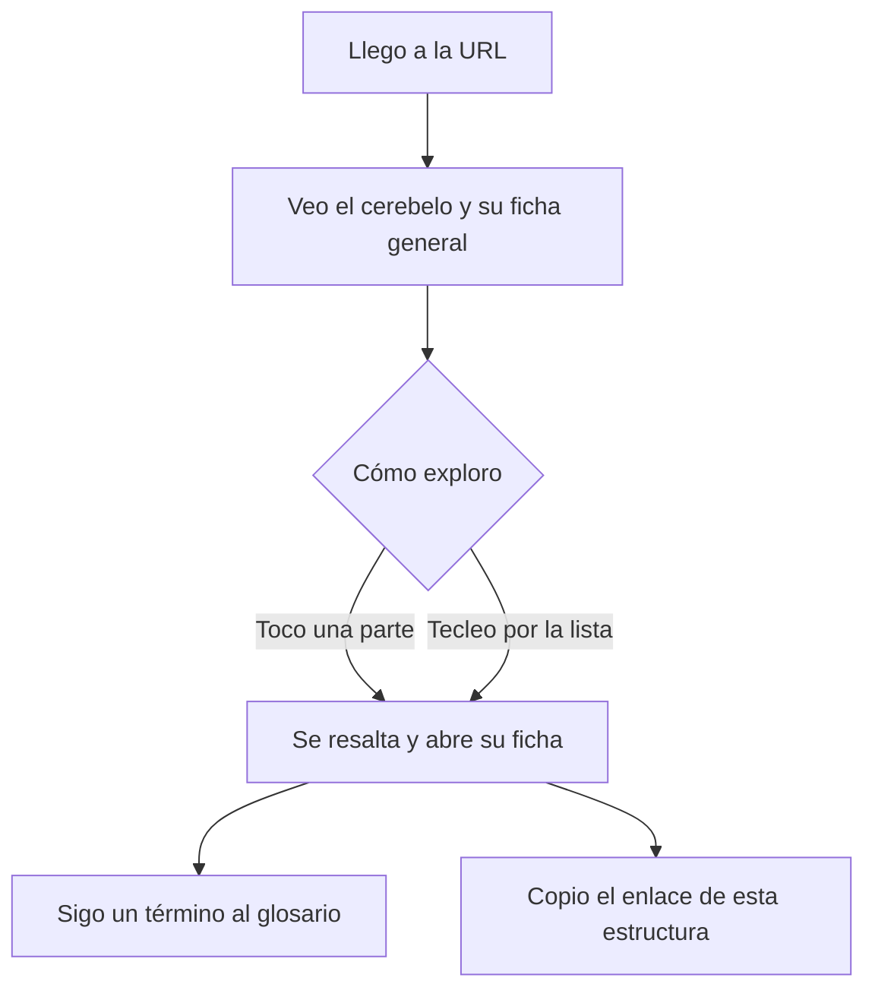

# Fase 1 — Diseño · v0.1 «cerebelo»

> Al aprobarse este documento, **el alcance queda congelado**. Toda idea posterior va a
> `backlog.md`, no a este hito.
>
> **Solo el agente escribe en este archivo.** Las correcciones de Max entran por chat o por
> `00-cuestionario.md`.

## Frase de valor

> Al terminar este hito voy a poder **abrir Neuroteca en el navegador, girar un modelo del
> cerebelo, tocar una de sus partes y leer ahí mismo qué es y qué hace, con las palabras
> técnicas enlazadas a su explicación** — que hoy no puedo.

## Tres avisos que hay que aprobar junto con el alcance

Los tres son desviaciones deliberadas. Están arriba para que se decidan aquí y no aparezcan
como sorpresa en la fase 2.

### 1. Este hito crea el motor **y** la primera pieza

El método prohíbe tocar el motor desde un hito de pieza. Este es un hito **de motor**, y
crea además el `esquema v1` y la primera pieza (`visor`), porque **un motor no se puede
validar sin al menos una pieza que lo use**. Ocurre una sola vez, igual que la creación del
esquema. A partir de `v0.2`, motor y piezas van en hitos separados.

### 2. El nivel de detalle será mixto, no todo `N1`

P-03 decía "una región cerebral a nivel `N1`". Estrictamente, el cerebelo a `N1` es **una
sola forma**, y sin partes no hay nada que tocar. Por eso:

| Estructura | Nivel |
|---|---|
| Cerebelo | `N1` |
| Vermis, hemisferios, lóbulo anterior, lóbulo posterior, lóbulo floculonodular | `N2` |

El esquema admite nivel por ficha, así que esto es legal y además prueba el mecanismo de
verdad. Pero **es más de lo que P-03 decía** y lo apruebas aquí o lo recortas aquí.

### 3. El modelo 3D no lo puede producir el agente

Es la única pieza del hito que está fuera de lo que un agente hace bien, y está en el camino
crítico. Las tres salidas posibles se evalúan en la fase 2 (decisión abierta `DEC-A1`):
modelarlo tú en Blender; partir de una geometría aproximada generada por código y refinarla
después; o empezar con un esquema 2D por capas y meter el 3D en `v0.2`. **No se arranca la
construcción sin esto cerrado.**

## Funciones incluidas

| ID | Función | Descripción en una línea |
|---|---|---|
| F-01 | Visor | Muestra el modelo del cerebelo; se puede girar, acercar y volver a la vista inicial |
| F-02 | Selección | Al tocar una parte del modelo, se resalta y se abre su ficha |
| F-03 | Ficha | Muestra nombre, término en latín, nivel de detalle, anatomía, fisiología y fuentes |
| F-04 | Glosario enlazado | Cada término técnico de una ficha lleva a su ficha fundacional |
| F-05 | Enlace directo | Cada estructura tiene su propia URL, que abre el atlas con ella seleccionada |
| F-06 | Recorrido sin visor | Lista navegable por teclado que da acceso a todas las fichas sin usar el 3D |

> **F-06 no es un extra de accesibilidad: es una función.** Las reglas del agente exigen que
> todo activo visual tenga equivalente textual y que todo lo operable con ratón lo sea con
> teclado. Si eso se deja para el final, no se hace.

## Estructuras incluidas

| # | Estructura | Nivel | Por qué entra |
|---|---|---|---|
| 1 | Cerebelo | `N1` | La región completa: forma, posición y relación con tronco y cerebro |
| 2 | Vermis | `N2` | División medial, visible a simple vista |
| 3 | Hemisferios cerebelosos | `N2` | Divisiones laterales |
| 4 | Lóbulo anterior | `N2` | División mayor |
| 5 | Lóbulo posterior | `N2` | División mayor |
| 6 | Lóbulo floculonodular | `N2` | División mayor, la de función vestibular más clara |

Las fichas fundacionales del glosario que estas seis necesiten entran también en este hito
(P-04). Lista preliminar, a cerrar en el encuadre del lote: sustancia gris y blanca,
corteza, aferente y eferente, propiocepción, tono muscular. **La lista definitiva sale del
lote, no de aquí.**

## Visualización

**Una sola pantalla**, dividida en dos zonas que se reordenan en vertical en móvil:

| Zona | Qué muestra | Acciones |
|---|---|---|
| Visor | El modelo del cerebelo con sus partes diferenciadas | Girar, acercar, volver a vista inicial, tocar una parte |
| Panel de ficha | La ficha de la estructura seleccionada | Leer, seguir enlaces al glosario, copiar el enlace directo |

Sin estructura seleccionada, el panel muestra la ficha del cerebelo completo (`N1`) y la
lista de partes — que es también el recorrido de F-06.

**Identidad visual:** `Pendiente — se cierra en fase 2`.

> Esto se traslada **obligatoriamente** al punto 5 del barrido de huecos de
> `02-especificacion.md` como decisión abierta.

### Flujo de uso

## Fuera de alcance

- **Núcleos cerebelosos profundos** (dentado, emboliforme, globoso, fastigio) — son `N3`,
  van a un hito futuro de la misma versión.
- **Pedúnculos cerebelosos y conexiones con el tronco** — son `N4`.
- **Circuito cerebeloso** (fibras musgosas y trepadoras, células de Purkinje) — es `N5`.
- **Cualquier otra región** del sistema nervioso.
- **Buscador.** Con seis estructuras no hace falta; entra cuando haya varias regiones.
- **Comparar estructuras entre sí.**
- **Clínica y patología** (síndromes cerebelosos, ataxia). Es contenido valioso y va al
  backlog, pero `v0` promete qué es y qué hace, no qué pasa cuando falla.
- **Cuestionarios, modo estudio o progreso del visitante.**
- **Cortes y secciones internas.** El visor muestra superficie.

## Criterios de aceptación

| ID | Criterio | Función |
|---|---|---|
| CA-01 | Abro la URL en un portátil y en menos de 3 s veo el modelo del cerebelo y puedo girarlo arrastrando | F-01 |
| CA-02 | Toco el vermis en el modelo, se resalta visiblemente y se abre su ficha | F-02 |
| CA-03 | Las seis estructuras tienen ficha con nombre, término en latín, nivel de detalle, anatomía, fisiología y al menos una fuente localizable | F-03 |
| CA-04 | Cada término técnico enlazado de una ficha abre una entrada de glosario que existe y tiene contenido — ninguna lleva a una entrada vacía | F-04 |
| CA-05 | Copio la URL del lóbulo floculonodular, la pego en otra ventana y se abre el atlas con esa estructura seleccionada | F-05 |
| CA-06 | Llego a las seis fichas y las leo enteras usando solo el teclado, sin tocar el visor | F-06 |
| CA-07 | Abro la URL en un móvil, giro el modelo y leo una ficha completa sin hacer zoom ni desplazamiento horizontal | F-01, F-03 |
| CA-08 | El nivel de detalle (`N1` o `N2`) se ve junto a cada estructura, sin tener que buscarlo | F-03 |

### Criterios de aislamiento — pieza `visor`

| ID | Criterio |
|---|---|
| CA-A1 | Apago la pieza `visor` desde el motor y el atlas sigue funcionando: se leen las seis fichas por el recorrido de F-06, sin pantalla en blanco |
| CA-A2 | Rompo la pieza `visor` a propósito (o el navegador no soporta 3D) y el resto del atlas sigue usable; el visitante ve el visor degradado con un aviso, no un error |

> `CA-A2` es el criterio más importante del hito. El atlas es público y se va a abrir en
> equipos que no controlamos, incluidos los de tus alumnos. Un visor 3D que falla **no puede
> llevarse el atlas por delante**.

## Impacto en el esquema de contenido

| Campo | Valor |
|---|---|
| **¿Este hito toca el esquema?** | Sí |
| **Tipo de cambio** | Creación (`v0` → `v1`) |
| **Contenido ya publicado afectado** | Ninguno — no hay contenido publicado todavía |
| **Nueva versión del esquema** | `v1` |

> La creación del esquema ocurre una sola vez y no dispara excepción, porque no hay
> contenido publicado que romper. A partir de aquí, cualquier cambio rompiente sí la dispara.

## Dependencia del carril de contenido

**Este hito no cumple su frase de valor por sí solo.** Entrega la máquina; el cerebelo lo
entrega el lote **`L-001-cerebelo`** por el carril de contenido, con su compuerta V.

| Qué | Dónde | Compuerta |
|---|---|---|
| Motor, esquema `v1`, pieza `visor` | Este hito | A → B → C → D |
| Las 6 fichas, las fundacionales y el modelo | `lotes/L-001-cerebelo/` | V |

Durante la fase 3 el hito se construye y se verifica con **contenido de prueba claramente
marcado como tal**. La publicación real de la región ocurre cuando ambos han cruzado su
compuerta.

> Este es el primer uso real del diseño de dos carriles. Si resulta incómodo, la fase 5 lo
> dirá y el método se corrige entonces — no antes.

## Expectativa de tamaño y periodo de uso

- **Tamaño esperado:** `Grande`. Crea el motor, el esquema y la primera pieza.
- **Periodo de uso de la fase 4:** 2 semanas, con uso real en clase si el calendario lo
  permite.

## Compuerta A

- [ ] Cada función tiene al menos un criterio de aceptación.
- [ ] La lista de "fuera de alcance" no está vacía.
- [ ] Los criterios se pueden responder con sí o no, sin opinar.
- [ ] Si es pieza: `CA-A1` y `CA-A2` presentes, y la versión de esquema declarada.
- [ ] Si toca el esquema: declarado si el cambio es compatible o rompiente.
- [ ] **Los tres avisos del principio están aprobados o corregidos.**
- [ ] Max aprobó el documento.

**Aprobado por Max el:** ____-__-__

## Historial de versiones
| Versión | Fecha | Cambio principal |
|---|---|---|
| 1.0 | 2026-09-18 | Versión inicial, escrita tras el paso 0. |
